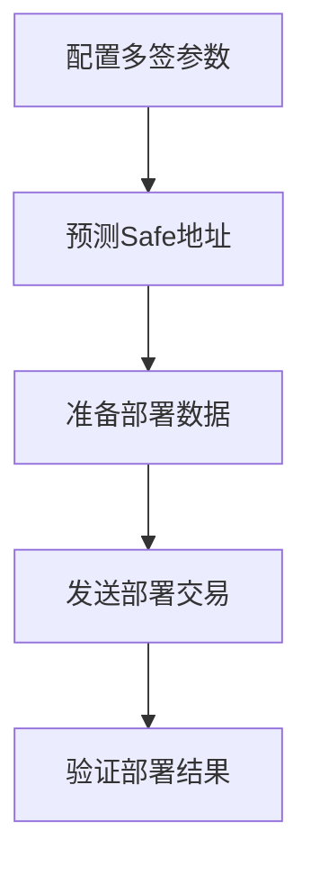
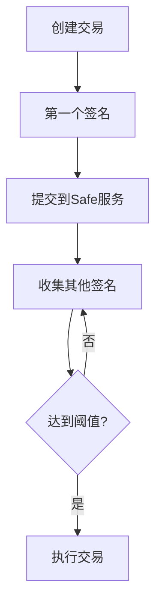

# Safe Multi-Signature Wallet Workflow

本文档展示如何使用Safe Core SDK Go版本创建和管理多签钱包的完整工作流程。

## 🎯 概述

Safe多签钱包是一种智能合约钱包，需要多个所有者签名才能执行交易。这为数字资产提供了更高的安全性和去中心化管理。

## 📋 准备工作

### 1. 环境要求

- Go 1.19+
- 以太坊RPC节点访问权限（如Infura）
- Safe Transaction Service API密钥
- 测试网ETH（用于部署gas费用）

### 2. 依赖安装

```bash
go mod init your-project
go get github.com/ethereum/go-ethereum
go get github.com/safe-global/safe-core-sdk-golang
```

## 🏗️ 第一步：多签钱包创建

### 配置多签参数

```go
// 多签钱包配置
owners := []string{
    "0x9C126aa4Eb6D110D646139969774F2c5b64dD279", // Owner 1
    "0xeB7E951F2D1A38188762dF12E0703aE16F76Ab73", // Owner 2
    "0x74f4EFFb0B538BAec703346b03B6d9292f53A4CD", // Owner 3
}
threshold := 2 // 需要2个签名才能执行交易
```

### 运行创建示例

```bash
go run ./examples/create_multisig_wallet.go
```

**输出示例：**
```
🏗️  Safe Multi-Signature Wallet Creation Demo
==============================================
🎯 Target Configuration:
   Network: Sepolia Testnet (Chain ID: 11155111)
   Signature Threshold: 2/3
   Owners:
      1. 0x9C126aa4Eb6D110D646139969774F2c5b64dD279
      2. 0xeB7E951F2D1A38188762dF12E0703aE16F76Ab73
      3. 0x74f4EFFb0B538BAec703346b03B6d9292f53A4CD
✅ Configuration validated successfully

🎯 Predicted Safe Address: 0x9C4c17C41fFb2B66E2Ba3b6e38D9bF32c80d771e
```

### 关键功能

1. **配置验证**：验证所有者地址格式和阈值设置
2. **地址预测**：使用CREATE2预测Safe合约地址
3. **交易数据准备**：生成Safe Factory调用数据
4. **Gas估算**：提供部署成本估算

## 🚀 第二步：实际部署

从创建示例中获取部署交易数据，发送到Safe Factory合约：

```
To: 0xa6B71E26C5e0845f74c812102Ca7114b6a896AB2
Data: 0x1688f0b900000000000000000000000029fcb43b46531bca003ddc8fcb67ffe91900c762...
Value: 0 ETH
```

**部署后验证：**
- ✅ 合约地址匹配预测地址
- ✅ 所有者配置正确
- ✅ 阈值设置正确

## 🧪 第三步：钱包测试

### 运行测试示例

```bash
go run ./examples/test_new_multisig_wallet.go
```

### 测试功能

1. **客户端初始化**
   ```go
   safeClient, _ := protocol.NewSafe(protocol.SafeConfig{
       SafeAddress: "0x9C4c17C41fFb2B66E2Ba3b6e38D9bF32c80d771e",
       RpcURL:      rpcURL,
       ChainID:     chainID,
   })
   ```

2. **配置验证**
   - 验证所有者列表
   - 检查签名阈值
   - 确认网络配置

3. **交易创建和签名**
   ```go
   // 创建交易
   transaction, _ := safeClient.CreateTransaction(ctx, txData)

   // 计算交易哈希
   txHash, _ := calculateSafeTransactionHash(transaction.Data, safeAddress, chainID)

   // 签名交易
   signature, _ := utils.SignMessage(txHash, privateKey)
   ```

4. **提交到Safe服务**
   ```go
   response, _ := apiClient.ProposeTransaction(ctx, proposal)
   ```

## 🔧 第四步：日常操作

### ETH转账示例

```bash
go run ./examples/transaction_workflow.go
```

**功能演示：**
- 📤 创建ETH/ERC20转账交易
- ✍️  多重签名收集
- 📊 交易状态跟踪
- ⚡ 交易执行

### ERC20代币操作

```bash
go run ./examples/erc20_abi_demo.go
```

**支持操作：**
- `transfer()` - 代币转账
- `approve()` - 授权额度
- `transferFrom()` - 代理转账
- `balanceOf()` - 查询余额

## 📊 工作流程总结

### 创建阶段


### 操作阶段


## 🎯 实际应用场景

### 1. 团队资金管理
- 公司金库管理
- 项目资金控制
- 多人审批流程

### 2. DeFi协议治理
- 协议参数调整
- 资金池管理
- 紧急响应机制

### 3. NFT项目管理
- 版税分配
- 项目资金管理
- 社区治理

## 🔒 安全最佳实践

### 私钥管理
- ✅ 使用硬件钱包
- ✅ 分散存储私钥
- ✅ 定期轮换访问权限
- ❌ 不要在代码中硬编码私钥

### 交易验证
- ✅ 仔细检查交易参数
- ✅ 验证合约地址
- ✅ 确认gas费用合理
- ✅ 使用Safe Web界面二次确认

### 阈值设置
- 推荐2/3或3/5配置
- 避免1/N单点故障
- 考虑成员可用性
- 预留紧急恢复方案

## 📚 参考资源

### 官方文档
- [Safe Protocol](https://docs.safe.global/)
- [Safe API Documentation](https://safe-transaction-mainnet.safe.global/)
- [Go-Ethereum Documentation](https://geth.ethereum.org/docs/)

### 示例代码
- `create_multisig_wallet.go` - 多签钱包创建
- `test_new_multisig_wallet.go` - 钱包测试验证
- `transaction_workflow.go` - 交易工作流程
- `erc20_abi_demo.go` - ERC20代币操作

### 网络资源
- Sepolia Testnet RPC
- Safe Transaction Service API
- Etherscan区块链浏览器

---

🎉 **完成！** 您现在已经掌握了使用Safe Core SDK Go版本创建和管理多签钱包的完整工作流程。